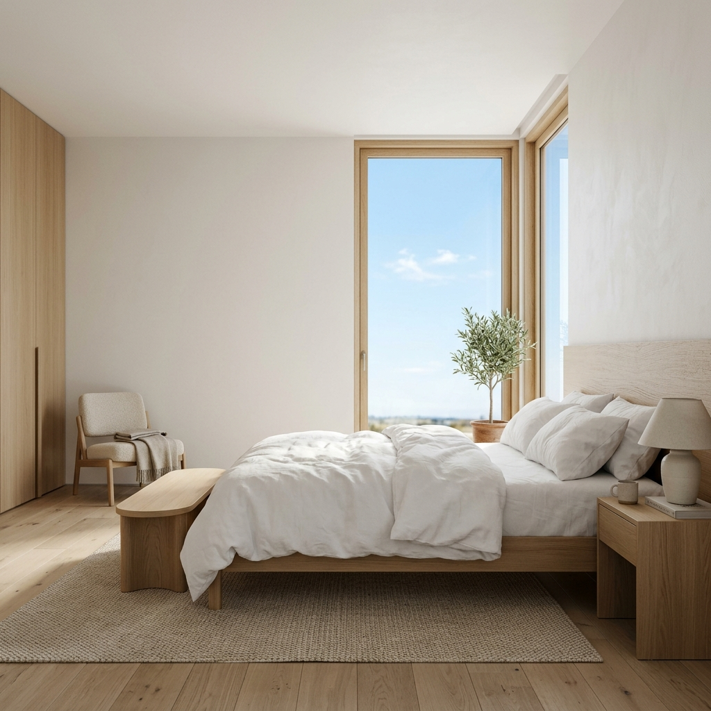
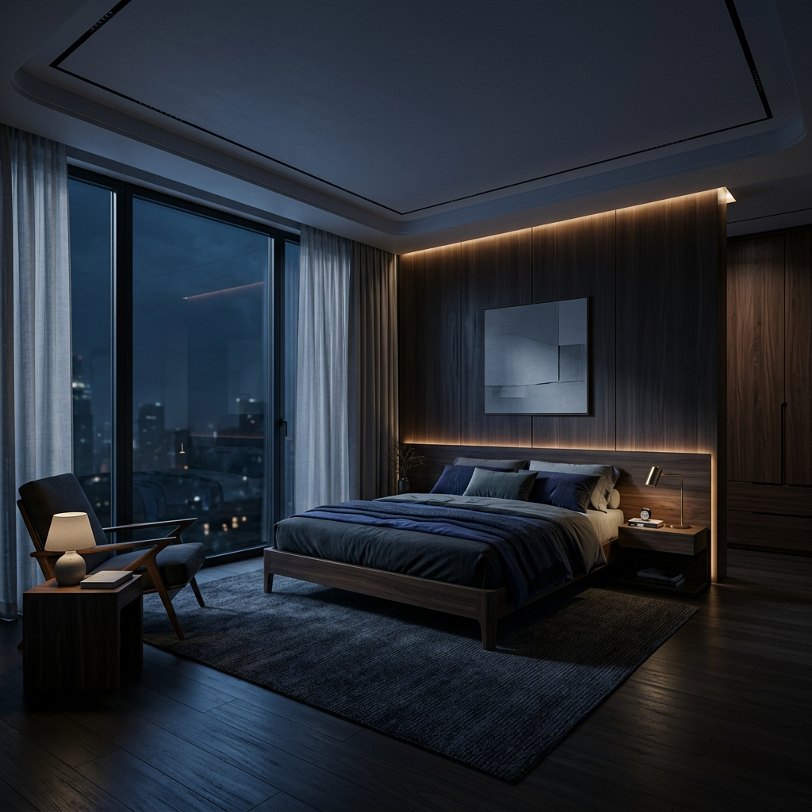
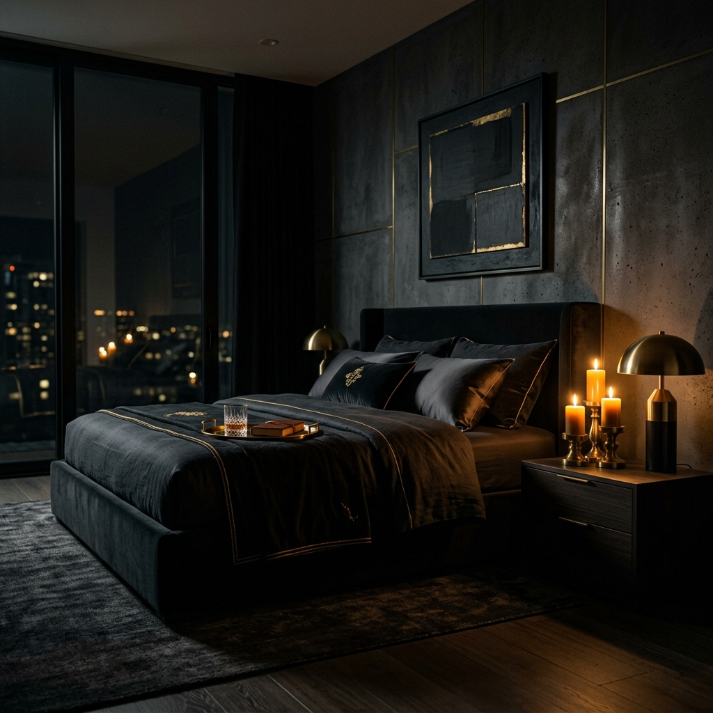
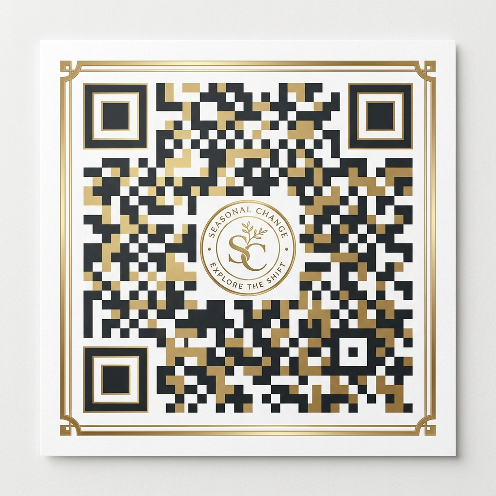

# 🌿 Seasonal View Luxury

[](https://seasonal-change.netlify.app/)
[](https://github.com/Hxni786/seasonal-view-luxury/stargazers)

An immersive, high-end furniture viewing experience that adapts to your environment. **Seasonal View Luxury** allows you to transform your digital sanctuary across six distinct atmospheric modes, from the crisp light of a winter morning to the intimate glow of a candlelit evening.

---

## ✨ Immersive Modes

Our interactive "Mode Dial" allows for instantaneous, zero-latency transitions between meticulously curated environments:

| Mode | Atmosphere | Visual Identity |
| :--- | :--- | :--- |
| **Pure Daylight** | ☀️ Light | Fresh, clean, and airy minimalism. |
| **Midnight Blue** | 🌙 Dark | Deep nocturnal silence with cool blue moonlight. |
| **Fresh Meadow** | 🌱 Light | Vibrant spring energy with soft organic tones. |
| **Deep Noir** | 🕯️ Dark | Intimate warmth, amber lighting, and rich shadows. |
| **Golden Hour** | 🌤️ Light | The saturated warmth of a late summer afternoon. |
| **Frosty Morning** | ❄️ Dark | Crisp, cool, and balanced high-contrast winter vibes. |

---

## 📸 Visual Previews

### **Atmospheric Transitions**

| Day Mode | Night Mode | Noir Mode |
| :---: | :---: | :---: |
|  |  |  |

---

## 🛠️ Technology Stack

- **Core**: Semantic HTML5 / Vanilla JavaScript (ES6+).
- **Styling**: Premium CSS3 with Glassmorphism, CSS Custom Properties (Variables), and Advanced Keyframe Animations.
- **Performance**: Integrated multi-layer preloading, Fetch Priority API, and Memory Caching to ensure instant asset transitions.
- **UX**: Persistent user preferences via `localStorage`.

---

## 📱 Mobile Experience

Scan the QR code below to experience **Seasonal View Luxury** directly on your mobile device. Optimized for mobile glassmorphism and touch-responsive interactions.



---

## 🚀 Installation & Deployment

1. **Clone the repository**:
   ```bash
   git clone https://github.com/Hxni786/seasonal-view-luxury.git
   ```
2. **Open the project**:
   Simply open `index.html` in any modern browser.

---

Managed by **Hxni786** | *Luxury in every pixel.*
